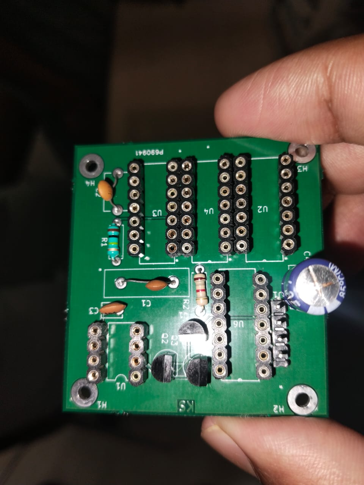

# PLL1 PCB Project

This repository contains the complete design and implementation of a basic Phase-Locked Loop (PLL) circuit, referred to as PLL1. The project was developed using KiCad for schematic capture and PCB layout, and includes all the necessary files for fabrication and assembly.
Before finalizing the PCB, the circuit was first tested on a perfboard to verify its functionality. Once validated, the PCB was fabricated and components were soldered manually.

# Preview
Assembled PCB
[](media/pll1-real-board.jpg)
Prototype Testing on Perfboard
[](media/pll1-proto-board.jpg)

# Project Structure
```
PLL1-PCB-Project/
├── src/
│   ├── PLL1.sch                  # Schematic file
│   ├── PLL1.kicad_pcb            # PCB layout
│   ├── PLL1.pro                  # KiCad project file
│   └── custom footprints/        # Custom footprint libraries
│
├── output/
│   ├── BOM.csv                   # Bill of Materials
│   ├── PickAndPlace.csv          # Component placement data
│   ├── pll1.drl                  # Drill file
│   ├── *.gbr                     # Gerber fabrication files
│
├── media/
│   ├── pll1-real-board.jpg       # Final PCB image
│   └── pll1-proto-board.jpg      # Perfboard prototype image
│
└── README.md                     # Project documentation
```

## Tools Used

* KiCad 8.0 – for creating the schematic and PCB layout
* Manual soldering – to assemble the fabricated PCB
* Perfboard – used for initial testing and verification of the circuit

## Output Files

The `output/` directory contains all necessary files for PCB fabrication and assembly:

* Gerber files
* Drill file
* Bill of Materials (BOM)
* Pick-and-place file

## Applications

This project is intended for educational purposes and hands-on practice. It’s a simple yet effective way to understand the working of PLL circuits and gain experience in:

* Schematic and PCB design
* Manual soldering techniques
* PCB fabrication process


